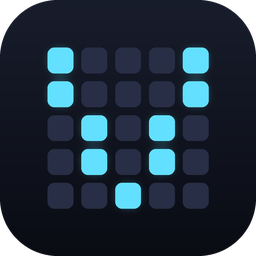
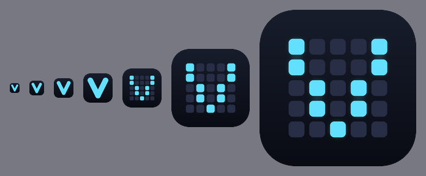

# VRMC



A mixed-reality MIDI controller for Meta Quest 3, and the desktop bridge that
makes it look like real hardware to your DAW.

Virtual pads, keys and Launchpads sit on your real desk in full-colour
passthrough. You play them with your hands — no controllers — and they arrive in
Ableton, Logic, REAPER or Pro Tools as if they were plugged into USB. Spawn a
Launchpad X in the headset and a correctly named MIDI port appears on the
computer; remove it and the port disappears. The DAW lights its grid, and you
see that in the headset.

```
  Quest 3                          Wi-Fi                    Desktop
┌──────────────────────┐                          ┌──────────────────────────┐
│  WebXR client        │                          │  Bridge (Node)           │
│  ├ hand tracking     │   binary packets over    │  ├ WebSocket + UDP       │
│  ├ poke detection    │ ───  ws / wss / udp  ──▶ │  ├ note bookkeeping      │
│  └ velocity + notes  │                          │  └ virtual MIDI port     │
└──────────────────────┘                          └───────────┬──────────────┘
                                                              │ CoreMIDI / ALSA
                                                              │ teVirtualMIDI
                                                              ▼
                                                        Your DAW
```

## Quick start

Requires Node 20.11+ and pnpm 10.

```bash
git clone https://github.com/AA-EION/VRMC.git
cd VRMC
pnpm install
pnpm build
```

**On the computer running your DAW:**

```bash
pnpm bridge
```

It prints the addresses it is listening on. On macOS and Linux a virtual MIDI
port named `VRMC` appears immediately — open your DAW's MIDI preferences and
enable it as an input. On Windows there is a setup step first; see
[docs/VIRTUAL-MIDI.md](docs/VIRTUAL-MIDI.md).

**On the headset:**

```bash
pnpm xr
```

Open the printed `https://` address in Meta Quest Browser, accept the
self-signed certificate warning, enter the bridge address, and tap **Enter mixed
reality**.

## What you get

| | |
|---|---|
| **Pad grid** | 4x4 MPC-style, notes from C1 on channel 10 (the drum channel). Velocity comes from how fast your finger is moving when it crosses the pad. |
| **Keyboard** | 25-key Launchkey-style layout on channel 1, with correctly proportioned black keys. Slide a pressed finger sideways for a glissando. |
| **Knobs** | Four pinch-and-drag controls sending 14-bit CC 21–24. |
| **Launchpad X** | Full emulation: 8x8 velocity pads with polyphonic aftertouch, top row and scene column, and live LEDs driven by the DAW. |
| **Launchpad Pro MK3** | The same, plus the mode column and track row. |

Layouts are data, not hard-coded — `MPC_4X4`, `LAUNCHPAD_8X8`, `LAUNCHKEY_25`
and `LAUNCHKEY_49` are all in `@vrmc/layout`, and new ones are a few numbers.

### Emulated hardware

The Launchpads are not lookalikes. They answer the Universal Device Inquiry with
the family code of the model they emulate, open MIDI ports named as the hardware
names them, and speak the real LED protocol — the velocity palette Ableton uses
for most of the grid, the RGB SysEx, and the flashing and pulsing channels that
distinguish a recording clip from a queued one. Device creation is dynamic: a
device spawned in the headset opens its ports there and then, which a DAW sees
as hardware being plugged in.

Protocol details and the 128-entry colour palette derive from
[CoreFW](https://github.com/anthonyhfm/launchpad-core-firmware), Anthony
Hofmeister's GPL-3.0 reimplementation of the Launchpad firmware. VRMC is
GPL-3.0-only for that reason.

## Repository layout

```
packages/
  protocol/      Wire format. Allocation-free encoder and decoder.
  layout/        Pad and keyboard geometry, O(1) point-to-zone lookup, placement.
  interaction/   Poke detection, velocity, pinch-grab controls. No dependencies.
  devices/       Launchpad emulation: identity, LED SysEx, colour palette.
apps/
  xr-client/     WebXR + React Three Fiber client for the headset.
  desktop-bridge/ Node receiver, dynamic virtual MIDI ports, device emulation.
```

The three packages are shared and framework-free; both apps are thin by
comparison. The parts that are hard to get right — the state machine that turns
a moving fingertip into a note, the geometry, the wire format — are separated
out precisely so they can be tested without a headset. They are, extensively.

## Commands

```bash
pnpm build              # build everything
pnpm test               # run all tests
pnpm typecheck          # typecheck all workspaces
pnpm bridge             # run the desktop bridge
pnpm xr                 # run the XR client dev server (HTTPS)

pnpm bridge -- --help          # bridge options
pnpm bridge -- --list-ports    # show MIDI outputs this machine can see
pnpm bridge -- --no-midi       # accept packets, send no MIDI (network testing)

pnpm --filter @vrmc/desktop-bridge run package   # build .app / .exe binaries
```

Turborepo handles the dependency order and caches results, so a second
`pnpm build` with nothing changed finishes immediately.

## Hosting the client

The XR client is a static site with a container ready to go:

```bash
cp .env.example .env        # optional; WEB_PORT defaults to 8080
docker compose up -d --build
```

It serves on `127.0.0.1:${WEB_PORT}` for an existing reverse proxy to sit in
front of and terminate TLS — which is required, since WebXR only runs in a
secure context. The image holds the client alone; the desktop bridge is not in
it and is downloaded separately. See
[Web deployment](docs/WEB-DEPLOYMENT.md#running-it-with-docker).

## Documentation

- [Architecture](docs/ARCHITECTURE.md) — how the pieces fit, and the latency
  budget they were designed against.
- [Virtual MIDI setup](docs/VIRTUAL-MIDI.md) — per-platform, including why
  Windows needs a driver and macOS does not.
- [Web deployment](docs/WEB-DEPLOYMENT.md) — hosting the client on a public
  site, and the HTTPS/`wss` constraint that catches every first attempt.
- [Wire protocol](docs/PROTOCOL.md) — the packet format, for writing another
  client.
- [Packaging](docs/PACKAGING.md) — building the `.app` and `.exe`, and why the
  native addons make it more than one step.

## Status

Everything here is built and tested: 94 unit tests cover the codec, both
layouts, the poke and knob state machines, the placement maths, the MIDI
translation, and the two transports over real sockets. Two of them are
allocation regression tests that simulate an hour of playing and assert the heap
does not grow — the zero-allocation claim the real-time design rests on is
checked, not assumed.

On top of that, a headless render test loads the built client in Chromium and
makes 21 assertions about the live 3D scene, including driving the real poke
detector with synthetic fingertips and confirming a strike lights the right pad
and emits the right note.

What has **not** been verified is everything needing hardware this was not built
on: no XR session has ever run, so passthrough and hand tracking are unproven;
the CoreMIDI and teVirtualMIDI backends have never run on macOS or Windows; no
DAW has ever seen an emulated Launchpad; and no latency figure in these docs is
a measurement. See
[Architecture](docs/ARCHITECTURE.md#what-is-not-yet-verified).

## The icon



A pad grid whose lit pads form a **V** — the instrument and the initial of
**V**R **M**IDI **C**ontroller in one shape.

Small sizes get their own artwork rather than a scaled-down master. At 16 pixels
a five-column grid gives each pad about three pixels and the letter dissolves
into texture, so anything up to 48 draws a single bold V instead. The tray glyph
drops the tile entirely, since it sits on a menu bar or taskbar whose colour the
OS owns.

Everything is generated from `assets/icon/generate.py` — SVG source, PNGs, a
multi-resolution `.ico`, an `.icns`, and the tray glyphs:

```bash
python3 assets/icon/generate.py
```

## Licence

GPL-3.0-only. See [LICENSE](LICENSE).

Launchpad protocol details, the USB and SysEx identity constants, and the
Novation colour palette derive from
[CoreFW](https://github.com/anthonyhfm/launchpad-core-firmware) by Anthony
Hofmeister, used under the GPL-3.0. VRMC is not affiliated with, endorsed by, or
supported by Focusrite or Novation; "Launchpad" and "Launchkey" are their
trademarks, used here only to describe what the emulation is compatible with.
